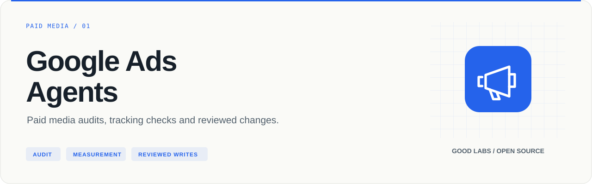
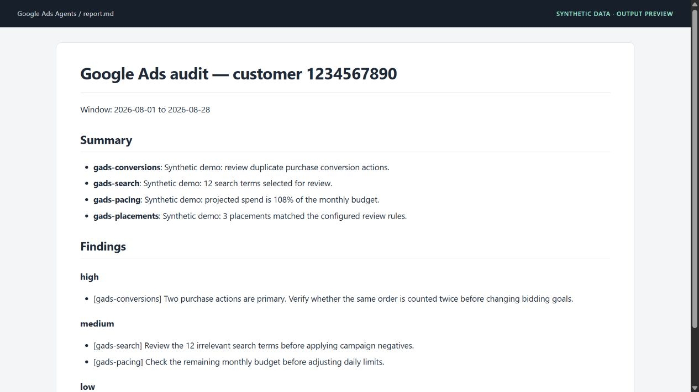

<p align="center">
  
</p>

# Google Ads Agents

Paid media audits, tracking checks and reviewed changes.

[](https://github.com/arcbaslow/google-ads-agents/actions/workflows/tests.yml)
[](https://github.com/arcbaslow/google-ads-agents/releases)
[](#installation)
[](LICENSE)

[Quick start](#quick-start) · [Example output](#example-output) · [Tests](#tests) · [Releases](#releases) · [Contributing](CONTRIBUTING.md)

A Python toolkit for investigating Google Ads accounts and preparing changes for review. Use individual adapters from a terminal, or use the specialist agents and `/gads` skills in an agent runtime. API responses are structured JSON; the audit driver combines them into reports.

## What you can do

| Area | Included capabilities |
| --- | --- |
| Campaigns | Search, Performance Max, App, Display, Shopping and YouTube analysis |
| Measurement | Conversion-action health and Google tag checks |
| Optimization | Search-term mining, negative candidates, recommendations, Quality Score and bid-strategy fit |
| Delivery | Budget pacing, anomalies, placement classification, demographic and geographic breakdowns |
| Assets | RSA strength, PMax asset coverage, creative briefs and asset workflows |
| Account operations | Per-MCC auth profiles, saved audit history and multi-account audits |
| Reviewed changes | Campaign creation, negatives and placement exclusions through explicit apply paths |

## Installation

Requires **Python 3.10+**. Live queries also require Google Ads account access, a developer token, and Google Cloud SDK (`gcloud`) for the default authentication path.

```bash
git clone https://github.com/arcbaslow/google-ads-agents.git
cd google-ads-agents
python -m venv .venv
```

Activate the environment with `source .venv/bin/activate` on macOS/Linux or `.venv\Scripts\Activate.ps1` in Windows PowerShell. Then:

```bash
python -m pip install -e ".[dev]"
```

Prefer uv? Run `uv venv`, `uv pip install -e ".[dev]"`, then prefix Python commands with `uv run`.

## Quick start

First print and run the Google sign-in command, then register a manager-account profile:

```bash
python scripts/gads_auth.py --adc
# Run the gcloud command printed above, then configure your profile:
python scripts/gads_auth.py --add-profile demo --developer-token YOUR_DEVELOPER_TOKEN --login-customer-id YOUR_MCC_ID
python scripts/gads_auth.py --use-profile demo
python scripts/gads_auth.py --check
python scripts/gads_auth.py --customers
```

Replace the example customer ID below with an account returned by `--customers`:

```bash
python scripts/gads_audit.py --customer 1234567890 --days 28 --output audit.json
python scripts/gads_report.py --input audit.json --format md --output audit.md
```

Add `--site https://example.com` to include the website tag check, and `--save-history` to retain a snapshot. The local session expires after 24 hours. For multiple MCCs, add profiles and switch with `--use-profile`. For an OAuth-client fallback, see [setup](docs/SETUP.md).

## Example output



The screenshot shows the actual Markdown report, rendered for documentation, using **synthetic data**. Reproduce it locally without Google credentials:

```bash
python scripts/gads_report.py --input examples/demo/audit.json --format md --output audit.md
python scripts/gads_report.py --input examples/demo/audit.json --format html --output audit.html
```

Read the [generated report](examples/demo/report.md) or inspect the [input fixture](examples/demo/audit.json).

## Everyday commands

```bash
python scripts/gads_search.py --customer 1234567890 --days 28 --negative-candidates --json
python scripts/gads_placements.py --customer 1234567890 --days 28 --json
python scripts/gads_recommendations.py --customer 1234567890 --json
python scripts/gads_anomalies.py --customer 1234567890 --days 30 --baseline-days 14 --z 2.0 --json
python scripts/gads_history.py --customer 1234567890 --changes --days 7 --json
python scripts/gads_audit.py --all-customers --days 28 --save-history --output audits.json
```

Use `--help` on an adapter for its complete flags. Read commands normally print a compact summary; `--json` selects machine-readable output.

### Agent workflow

The [router](skills/gads/SKILL.md) exposes commands such as:

```text
/gads audit 1234567890
/gads search 1234567890
/gads pmax 1234567890
/gads conversions 1234567890
/gads pacing 1234567890
/gads quality 1234567890
```

The repository includes [plugin metadata](.claude-plugin/plugin.json), specialist [agent definitions](agents/) and [skills](skills/). Other runtimes can follow [AGENTS.md](AGENTS.md) and call the same Python adapters. The skill orchestrator performs conversion and tag checks before the wider analysis; the standalone `gads_audit.py` driver collects adapter results.

### Changes to an account

Review the proposed operation before using a write command. The agent workflow asks for confirmation; the Python CLI treats `--apply` as authorization and does **not** add an interactive confirmation prompt.

```bash
# Validate a campaign definition through the API without creating it.
python scripts/gads_creation.py --customer 1234567890 --context-file context.json --validate-only --json

# Validate proposed negatives without applying them.
python scripts/gads_apply.py --customer 1234567890 negatives --input negatives.json --validate-only --json
```

Campaign creation checks the business context, website, measurement setup, goal, budget, bidding and targeting. New campaigns are created paused. Replace `--validate-only` with `--apply` only after reviewing the result.

### Optional hooks and sign-in service

The [hooks guide](docs/HOOKS.md) covers the session-expiry guard and opt-in Telegram notifications. The separate FastAPI service in [webapp/](webapp/) supports hosted sign-in; it is not required to run local audits.

## Tests

```bash
python -m pytest scripts/ -q
python -m ruff check scripts/ hooks/ webapp/

# Optional hosted sign-in service: install its dependencies, then test it.
python -m pip install -r webapp/requirements.txt
python -m pytest webapp/tests/ -q
```

The suites use mocks and temporary credential stores. They cover auth profiles and expiry, GAQL, placement rules, campaign validation, report rendering, audit history, optimization heuristics, hooks, OAuth, sessions and the web API. No live Google Ads account is needed. CI runs the adapter and webapp suites on Python 3.10–3.13; see the [verification record](docs/VERIFICATION.md) for the release run.

## Repository map

| Path | Purpose |
| --- | --- |
| [scripts/](scripts/) | API adapters, report rendering and unit tests |
| [agents/](agents/) · [skills/](skills/) | Specialist instructions and `/gads` routing |
| [hooks/](hooks/) | Session guard and Telegram notifications |
| [webapp/](webapp/) | Optional hosted sign-in service and tests |
| [examples/demo/](examples/demo/) | Reproducible report with synthetic data |
| [docs/](docs/) | Setup, hooks, release and verification guides |

## Releases

**[v0.6.1](https://github.com/arcbaslow/google-ads-agents/releases/tag/v0.6.1)** — see the [release notes](docs/RELEASE_NOTES.md) for this release and the [changelog](CHANGELOG.md) for project history.

GitHub Releases include downloadable artifacts and checksums. Package-registry publication is a separate, opt-in workflow; a GitHub release does not imply that the same version is available on PyPI or npm. Maintainers can follow the [release guide](docs/RELEASING.md).

## Contributing

Read [CONTRIBUTING.md](CONTRIBUTING.md), run the checks above, and include a minimal reproduction for bugs. Report vulnerabilities through [SECURITY.md](SECURITY.md).

## Related tools

| Project | Use it for |
| --- | --- |
| [Google Analytics Agent](https://github.com/arcbaslow/google-analytics-agent) | GA4 data quality, funnels and property management. |
| [Search Console Agent](https://github.com/arcbaslow/google-search-console-agent) | Search performance, indexing and page experience. |
| [Meta Ads Agents](https://github.com/arcbaslow/meta-ads-agents) | Campaign performance, creative fatigue and event health. |
| [GTM Diff](https://github.com/arcbaslow/gtm-diff) | Review the changes in your Google Tag Manager exports. |
| [Figma Taxonomy Gen](https://github.com/arcbaslow/figma-taxonomy-gen) | Turn interactive designs into a reviewable tracking plan. |

Maintained by [Good Labs](https://goodlabs.kz) — measurement implementation, tracking plans and analytics audits.

## License

[MIT](LICENSE) © Dilshat Rakhimov. This is an independent project; it is not an official product of the platform vendors.
